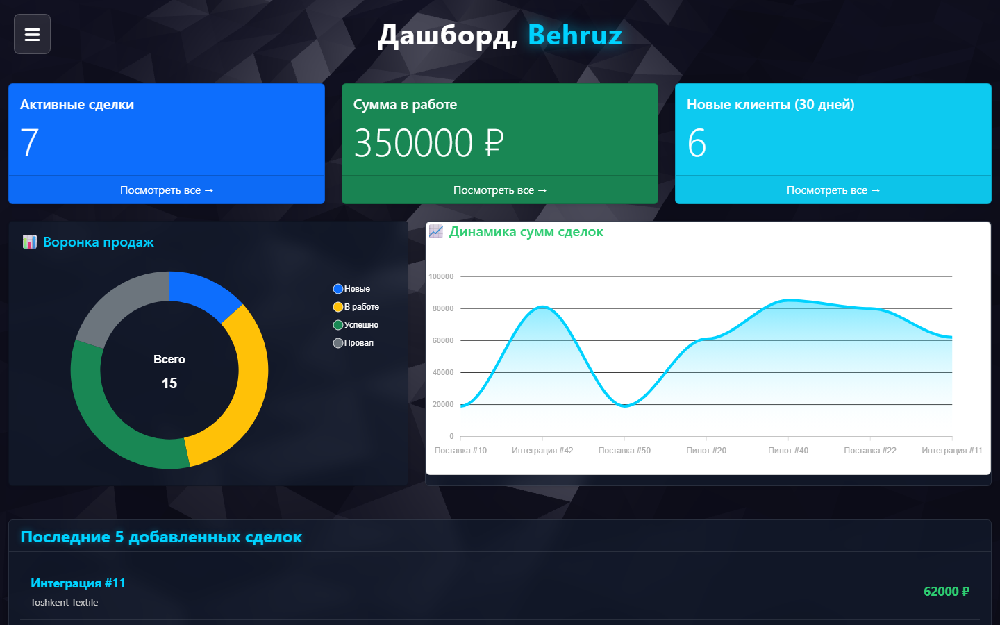
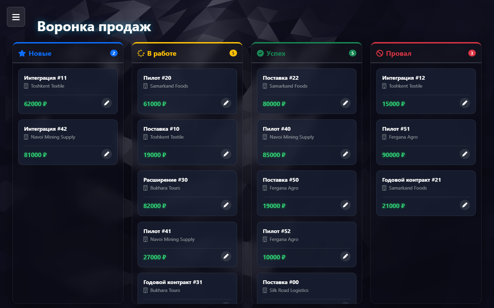

# Deep CRM

CRM для небольшого отдела продаж. Менеджер ведёт своих клиентов и сделки, ставит задачи с дедлайнами и смотрит воронку на дашборде. Django 5.2, PostgreSQL, Celery и Redis поднимаются одной командой Docker Compose.

[](LICENSE)
[](https://github.com/tgKishikaisei/deep-crm/actions/workflows/ci.yml)





## Возможности

- **Клиенты и сделки.** Сделка проходит стадии «Новая», «В работе», «Успешно закрыта», «Не успешно закрыта». Канбан-доска показывает все четыре колонки, история изменений хранится через django-simple-history.
- **Задачи.** У задачи есть срок и исполнитель; календарь на FullCalendar показывает задачи и сделки на одной сетке.
- **Дашборд и рейтинг.** Воронка и выручка на ApexCharts, таблица лидеров по сумме выигранных сделок. Цифры кэшируются в Redis, сигнал сбрасывает кэш при любом изменении сделки.
- **Письмо клиенту.** Когда сделка переходит в «Успешно закрыта», Celery отправляет письмо в фоне, после коммита транзакции.
- **Поиск по Ctrl+K.** Ищет клиентов и сделки текущего менеджера без перезагрузки страницы.
- **REST API.** `/api/v1/clients/`, `/api/v1/deals/`, `/api/v1/tasks/` на DRF, Swagger и Redoc для сотрудников.

Каждый менеджер видит только свои данные: чужой клиент, сделка или задача отвечают 404 и в интерфейсе, и в API. Подробности в [SECURITY.md](SECURITY.md).

## Стек

| Часть | Что используется |
|---|---|
| Бэкенд | Django 5.2 LTS, Django REST Framework, Celery, django-axes, django-simple-history |
| Данные | PostgreSQL 15, Redis 7 (брокер и кэш) |
| Интерфейс | Django Templates, Bootstrap 5, ApexCharts, FullCalendar, Vanta.js, AOS |
| Запуск | Docker Compose, gunicorn, whitenoise, пример nginx с TLS в `deploy/nginx.conf` |
| Проверки | Django test, pip-audit, bandit, gitleaks, `check --deploy` в GitHub Actions |

## Запуск через Docker

```bash
git clone https://github.com/tgKishikaisei/deep-crm.git
cd deep-crm
cp .env.example .env          # впишите SECRET_KEY, DB_PASSWORD, REDIS_PASSWORD, ALLOWED_HOSTS
docker compose up -d --build
docker compose exec web python manage.py createsuperuser
```

Compose поднимает Postgres, Redis с паролем, разовый `migrate`, веб на gunicorn и воркер Celery. Сайт слушает `127.0.0.1:8000`; наружу его выпускает обратный прокси.

Для разработки с автоперезагрузкой:

```bash
docker compose -f docker-compose.yml -f docker-compose.dev.yml up --build
```

## Запуск без Docker

Нужны Python 3.10+, PostgreSQL и Redis.

```bash
python -m venv venv
venv\Scripts\activate              # Linux и macOS: source venv/bin/activate
pip install --require-hashes -r requirements.txt -r requirements-dev.txt
cp .env.example .env                # DB_HOST=127.0.0.1, REDIS_URL=redis://:пароль@127.0.0.1:6379
python manage.py migrate
python manage.py runserver
```

Воркер Celery запускается отдельно, на Windows с `--pool=solo`:

```bash
celery -A crm_project worker -l info --pool=solo
```

## Тесты

```bash
python manage.py test --settings=crm_project.settings.test
```

Тестовые настройки используют SQLite в памяти и локальный кэш, поэтому Postgres и Redis для тестов не нужны.

## Живая версия

Публичного стенда нет, проект запускается локально по инструкции выше.

## Лицензия

[MIT](LICENSE) © 2026 Behruz Avezmatov
